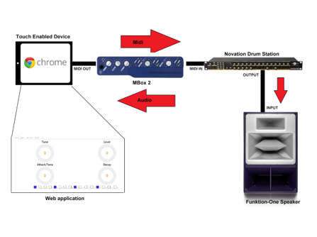
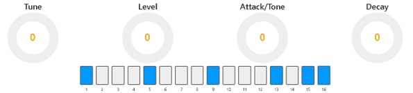
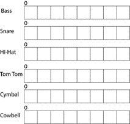
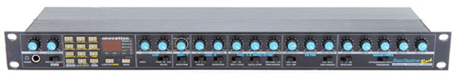

# Drum station
## Authors

* **[Conor Corcoran](https://github.com/Conor_corcoran)** - *Design, Physical Set Up* 
* **[Dean Gaffney](https://github.com/DeanGaffney)** - *Design, Code* 

## Abstract
A web application running in a browser to control analog hardware with a step sequencer is to create drum patterns. A UCD approach was taken with the design. WebMidi is used to create this project along with JavaScript and React.js.

### Diagram

The diagram above shows how the web application works with the physical hardware. Basically, the web application sends Midi messages using the WebMidi api. These mesaages can be interpreted by the MBox, which is an interface that can pass these messages onto the Novation DrumStation. Finally, the Drum Station creates the sound which is played out of the Funktion-One Speaker.

### User Interface

This is the user interface of the web app. It was designed to mimic the physical DrumStation which has controls to control characteristics of the drums. Below these controls is a step sequencer. This is a series of checkboxes that control the patern the drums play. 

### Step Sequencer

Each drum can have a different pattern, which will make the resulting sound more  interesting. 

### Novation DrumStation

This is the physical piece of hardware that the web app is controlling. The Novation DrumStation was produced in the Mid-90s and uses Midi technology to control it. The DrumStation can't be played by itself, which is where the web app conmes in. It gives users a way of controlling it to produce their desired sounds and patterns

